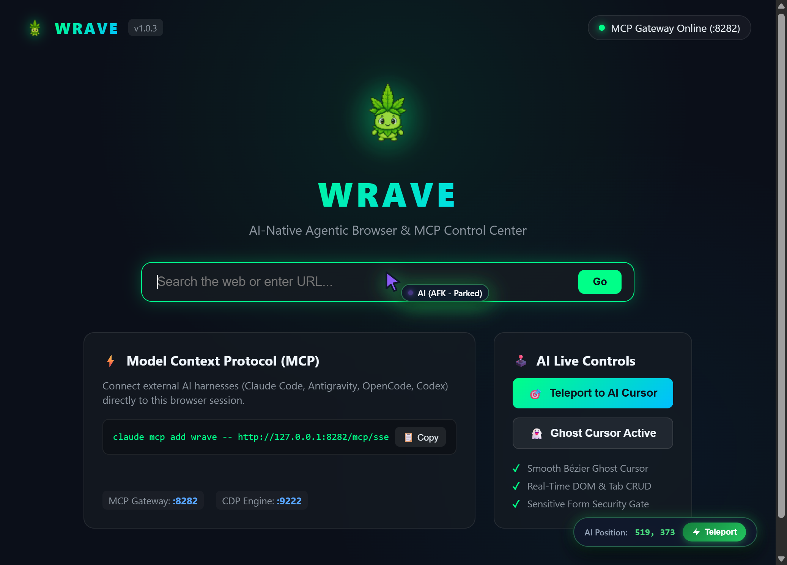

# Wrave MCP Server

> AI-Native Model Context Protocol (MCP) Gateway for Brave Browser  
> Connect Google Antigravity, Claude Code, Claude Desktop, OpenAI Codex, OpenCode, Cursor, and any MCP-compliant AI agent directly to your active Brave browser.

[](https://www.typescriptlang.org/)
[](https://opensource.org/licenses/MIT)
[](https://modelcontextprotocol.io/)
[](https://www.npmjs.com/package/wrave-mcp)

---

## Overview

Wrave bridges AI coding assistants and autonomous agents to your live Brave browser session with zero friction. It is engineered for maximum speed, security, and developer ergonomics:

- **Non-Invasive**: Operates alongside your browser without modifying Brave Leo AI, Brave Rewards, Web3 Wallet, or your default New Tab experience.
- **Compound 1-Turn Actions**: Drastically reduces multi-turn latency loops. Execute clicks, text entry, and form submissions while returning updated page snapshots in a single turn.
- **Semantic Element Indexing**: Automatically tags clickable and input elements with indexed identifiers (`@1`, `@2`, `@3`, etc.), returning bounding boxes, labels, and roles so models never need to guess obfuscated CSS class names.
- **Auto-Dismiss Overlays**: Detects and bypasses common modal dialogs (cookie banners, "Not Now", "Dismiss") during navigation and snapshot capture.
- **Dual Transport Support**:
  - **Stdio Mode**: Spawned automatically on demand by AI harnesses (no daemon or background server to manage).
  - **Local HTTP/SSE Server**: Optional persistent server on `http://127.0.0.1:8282/mcp` (similar to Figma Dev Mode).
- **Hybrid Automation Engine**:
  - **CDP Engine** (`:9222`): Sub-millisecond direct Chrome DevTools Protocol automation.
  - **Extension Bridge** (`:8282/extension`): High-speed WebSocket bridge directly through the extension without requiring special browser flags.
- **Pure TypeScript**: Strongly typed codebase with comprehensive integration test coverage.

---

## Installation in Brave Browser

Assuming you have downloaded the latest `wrave-extension-v*.zip` from [GitHub Releases](https://github.com/AMARA-Khaled/wrave/releases/latest):

1. **Extract the ZIP Archive**: Unzip `wrave-extension-v*.zip` into a local directory on your machine.
2. **Open Extensions Page**: Open Brave and navigate to:
   ```
   brave://extensions
   ```
3. **Enable Developer Mode**: Turn on the **Developer mode** toggle in the top-right corner.
4. **Load the Extension**: Click **Load unpacked** and select the folder where you extracted the extension.
5. **Pin to Toolbar**: Pin the Wrave extension icon for quick access to status, port diagnostics, and connection indicators.



---

## Connect Your AI Harness

Wrave supports both automatic Stdio launching (recommended) and connecting to a persistent local server.

### 1. Google Antigravity

Add Wrave to `~/.gemini/config/mcp_config.json`:

#### Option A: On-Demand Stdio (Recommended)
```json
{
  "mcpServers": {
    "wrave": {
      "command": "npx",
      "args": ["-y", "wrave-mcp", "--stdio"]
    }
  }
}
```

#### Option B: Persistent Local Server
If running `npx wrave-mcp --server`:
```json
{
  "mcpServers": {
    "wrave": {
      "serverUrl": "http://127.0.0.1:8282/mcp"
    }
  }
}
```

---

### 2. Claude Code (CLI)

Add to Claude Code with a single terminal command:

```bash
# On-demand stdio (recommended)
claude mcp add wrave -- npx -y wrave-mcp --stdio

# Or connect to a running HTTP/SSE server:
claude mcp add wrave -- http://127.0.0.1:8282/mcp/sse
```

---

### 3. Claude Desktop

Add to your `claude_desktop_config.json`:
- **macOS**: `~/Library/Application Support/Claude/claude_desktop_config.json`
- **Windows**: `%APPDATA%\Claude\claude_desktop_config.json`

```json
{
  "mcpServers": {
    "wrave": {
      "command": "npx",
      "args": ["-y", "wrave-mcp", "--stdio"]
    }
  }
}
```

---

### 4. OpenAI Codex & OpenCode

Add to your `opencode.json` configuration:

```json
{
  "mcp": {
    "servers": {
      "wrave": {
        "command": "npx",
        "args": ["-y", "wrave-mcp", "--stdio"]
      }
    }
  }
}
```

Or connect via HTTP endpoint:
```json
{
  "mcp": {
    "servers": {
      "wrave": {
        "url": "http://127.0.0.1:8282/mcp"
      }
    }
  }
}
```

---

### 5. Cursor & Windsurf

Add to `~/.cursor/mcp.json` or `~/.codeium/windsurf/mcp_config.json`:

```json
{
  "mcpServers": {
    "wrave": {
      "command": "npx",
      "args": ["-y", "wrave-mcp", "--stdio"]
    }
  }
}
```

---

## Available MCP Tools (21 Primitives)

### High-Speed Compound Actions (1-Turn)
| Tool Name | Description | Parameters |
|---|---|---|
| `wrave_get_snapshot` | Instant page snapshot with indexed interactive elements (`@1`, `@2`, etc.), title, and URL. | `tab_id` |
| `wrave_click_and_read` | Click an element (by selector, `@ref` like `@1`, or x/y) and immediately return the updated page snapshot. | `tab_id`, `selector`, `x`, `y` |
| `wrave_type_and_submit` | Type text into an input or contenteditable field and submit with Enter in 1 turn. | `tab_id`, `selector`, `text`, `clear_first`, `submit_key` |

### Core Navigation & Inspection
| Tool Name | Description | Parameters |
|---|---|---|
| `wrave_list_tabs` | List all open tabs with ID, title, URL, and active state. | *None* |
| `wrave_open_tab` | Open a new tab with specified URL (auto-returns page snapshot & indexed elements). | `url`, `activate` (bool) |
| `wrave_close_tab` | Close an open tab by its ID. | `tab_id` |
| `wrave_focus_tab` | Bring tab to foreground and activate it. | `tab_id` |
| `wrave_reload_tab` | Reload tab with optional cache bypass. | `tab_id`, `ignore_cache` |
| `wrave_get_tab_state` | Read title, URL, viewport dimensions, and scroll position. | `tab_id` |
| `wrave_get_dom_tree` | Extract clean, LLM-friendly DOM tree with bounding boxes `[x, y, w, h]` or raw HTML. | `tab_id`, `max_depth`, `html` |
| `wrave_get_accessibility_tree` | Extract full AX accessibility tree (roles, labels, values). | `tab_id` |
| `wrave_take_screenshot` | Capture viewport or full-page screenshot as base64 image. | `tab_id`, `full_page`, `format` |

### Direct Interaction Primitives
| Tool Name | Description | Parameters |
|---|---|---|
| `wrave_click` | Dispatch click to element selector, `@ref` (e.g. `@1`), or pixel coordinates. | `tab_id`, `selector`, `x`, `y` |
| `wrave_double_click` | Dispatch double-click to element selector or `@ref`. | `tab_id`, `selector` |
| `wrave_type_text` | Type text into inputs, textareas, and rich contenteditable editors (`@ref` supported). | `tab_id`, `selector`, `text`, `clear_first` |
| `wrave_press_key` | Dispatch native keyboard key event (Enter, Tab, Escape, etc.). | `tab_id`, `key` |
| `wrave_scroll_page` | Scroll viewport or target scrollable container. | `tab_id`, `delta_y`, `delta_x` |
| `wrave_execute_script` | Evaluate arbitrary JavaScript expression in tab context. | `tab_id`, `script` |
| `wrave_get_cookies` | Retrieve cookies for the active domain. | `tab_id` |
| `wrave_print_to_pdf` | Export active page to PDF document. | `tab_id` |
| `wrave_get_console_logs` | Retrieve intercepted console logs from the page. | `tab_id` |

---

## Development & Building from Source

```bash
# 1. Clone repository
git clone https://github.com/AMARA-Khaled/wrave.git
cd wrave

# 2. Install dependencies
npm install

# 3. Build TypeScript codebase
npm run build

# 4. Run automated test suite
npm test

# 5. Package extension bundle
npm run pack:extension
```

---

## Repository Structure

```
wrave/
├── package.json              # Unified npm package manifest with TypeScript tooling
├── tsconfig.json             # ES2022 / NodeNext compiler configuration
├── assets/                   # Screenshots and documentation media
├── dist/
│   ├── wrave-engine/         # Compiled TypeScript JavaScript & d.ts declarations
│   └── wrave-extension-*.zip # Packaged extension bundles for release
└── src/
    ├── wrave-extension/      # Unpacked Brave Browser Extension (MV3)
    │   ├── manifest.json     # Clean DevTools/MCP toolbar manifest
    │   ├── background.js     # Background Service Worker & WebSocket bridge
    │   ├── popup.html/css/js # Dark-mode status popup
    │   └── options.html/css/js# Diagnostic & settings page
    └── wrave-engine/         # TypeScript MCP Engine Source
        ├── types.ts          # Strong MCP & browser protocol interfaces
        ├── cdp-engine.ts     # High-speed Chrome DevTools Protocol client
        ├── mcp-server.ts     # Dual SSE / Stdio JSON-RPC 2.0 MCP server
        ├── cli.ts            # CLI daemon & stdio launcher
        └── test/             # Automated test suite
```

---

## License

MIT © [AMARA Khaled](https://github.com/AMARA-Khaled)
